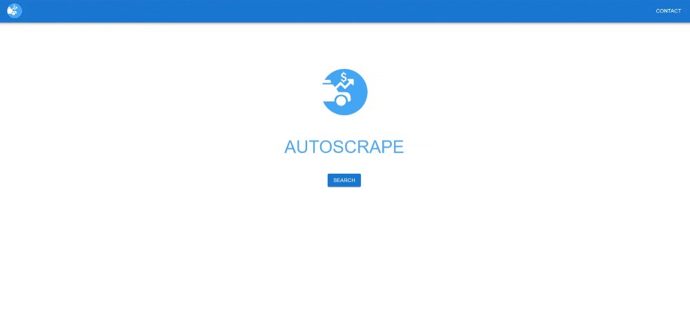

This is a [Next.js](https://nextjs.org/) project that scrapes the web using Puppeteer to get market data about vehicle makes and models (price, mileage, location) and download the data in CSV format.

## Getting Started

Requirements:
- Node (ideally v22.1.0 or greater)

Install the dependencies:
```
npm install
```

No need to build. Run the development server:

```bash
npm run dev
```

Open [http://localhost:3000](http://localhost:3000) with your browser to see the app.

